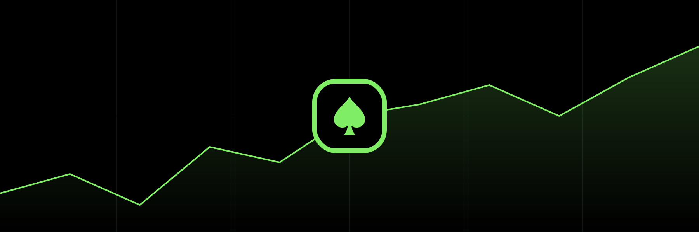

<div align="center">
  
</div>

<br />

**qPACE**: The Technical Analysis framework for Python and JavaScript, written in Rust, designed to be extremely fast. Everything you need in one place - from research to production.

Get started at **<https://qpace.dev>**

<a href="https://discord.gg/E4GBpN3SxT"></a>

## Table of Contents

- [Features](#features)

- [Examples](/examples)

- [Pine from Python/JavaScript](#pine-from-python-javascript)

- [Installation](#installation)

- [Motivation](#motivation)

- [Community](#community)

## Features

- Bindings for Python and JavaScript (WebAssembly)

- Simple, yet powerful and fully typed API

- **Pine compiler - run your indicators/strategies from Python/JavaScript with accurate results**

- **Extremely fast backtesting with vectorization support**

- **TA indicators written in [Pine](/lib/content/ta.pine), compiled via [QPC](#pine-from-pythonjavascript)**
  - Accumulation/Distribution (ACCDIST)
  - Relative Strength Index (RSI)
  - Moving Average Convergence Divergence (MACD)
  - Bollinger Bands (BB, BB %b, BB width)
  - Stochastic Oscillator
  - Average True Range (ATR)
  - True Range (TR)
  - Exponential Moving Average (EMA)
  - Simple Moving Average (SMA)
  - Relative Moving Average (RMA)
  - Volume Weighted Moving Average (VWMA)
  - Linear Weighted Moving Average (LWMA)
  - Symmetrically Weighted Moving Average (SWMA)
  - Hull Moving Average (HMA)
  - Choppiness Index (CHOP)
  - Chande Kroll Stop (CKS)
  - Aroon
  - Commodity Channel Index (CCI)
  - Cross/Over/Under
  - Highest/Lowest/Bars
  - Change
  - Cumulative (CUM)
  - Bars Since
  - Rate of Chance (ROC)
  - Super Trend
  - Chaikin Money Flow (CMF)
  - Coppock Curve
  - Donchian Channels
  - Price Oscillator
  - Relative Vigor Index (RVGI)
  - Relative Volatility Index (RVI)
  - Ultimate Oscillator
  - Vortex Indicator
  - Williams %R

- CLI
  - View/Export symbols
  - View/Export OHLCV
  - Compile Pine to Python/JavaScript

- OHLCV ops
  - Reading/Writing from CSV, Parquet
  - Resampling
    - Aggregation (rolling window or align to UTC) - `15m` -> `8h`, `1D`, `4D`, ...
    - Tick Bars
    - Dollar Bars
    - Volume Bars
  
- Performance metrics
  - Sharpe Ratio
  - Sortino Ratio
  - Omega Ratio

- Parameter optimization
  - Grid Search
  - Genetic Evolution

## Installation

### Python

```bash
pip install qpace
```

### JavaScript

```bash
npm install qpace
```

## Pine from Python/JavaScript

QPC is specially designed compiler to translate any Pine code into efficient Rust code that is then exposed to Python and JavaScript, allowing you to run your favorite Pine scripts in the most efficient way possible.

Check an example [here](/examples/pine).

## Community
